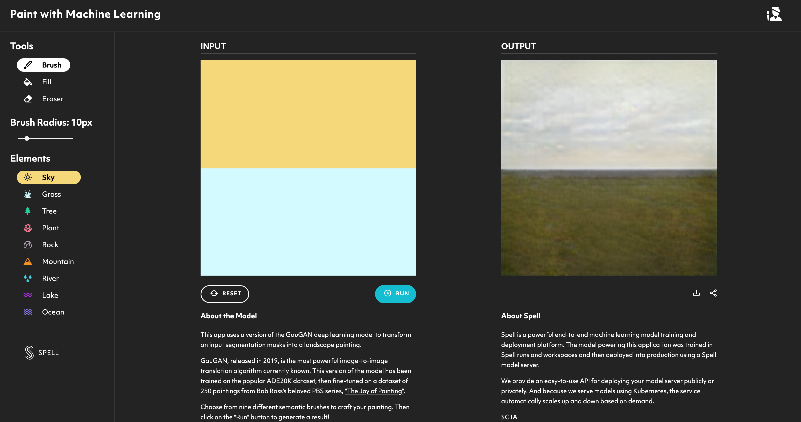

# paint-with-ml



This app uses a version of the GauGAN deep learning model to transform an input segmentation masks into a landscape painting.

GauGAN, released in 2019, is the most powerful image-to-image translation algorithm currently known. This version of the model has been trained on the popular ADE20K dataset, then fine-tuned on a dataset of 250 paintings from Bob Ross's beloved PBS series, "The Joy of Painting".

Choose from nine different semantic brushes to craft your painting. Then click on the "Run" button to generate a result! Here are some example outputs:


Try it out yourself by visiting [paintwithml.spell.ml](http://paintwithml.spell.ml/). To learn more about how this model was built and served, check out [the accompanying article](https://spell.ml/blog/paint-with-machine-learning-X10i3BAAACQAUI_o) on the Spell blog.

## Project hierarchy

```
├── LICENSE
├── README.md             <- You're reading it!
├── lib/                  <- Vendored model code (Python).
│   ├── SPADE-master/     <- Vendored copy of NVlabs/SPADE.* **
│   └── model_server/     <- Model server code (uses Spell model serving).
├── models                <- Model assets
│   ├── model_0.py        <- The build script for the first model trained.
│   ├── ...
│   ├── model_N.py        <- The build script for the last model trained.
│   └── README.md         <- Reference to the models builds.
├── notebooks             <- Jupyter notebooks discussing the model build process.
├── requirements.txt      <- Project environment requirements, installable with pip.
├── app/                  <- User-facing demo React web app.
│   ├── README.md         <- Reference on how to build and serve the web app.
│   ├── index.html
│   ├── components/       <- React components.
│   ├── models/           <- Model configs (see model_server/).
│   ├── static/
│   ├── requirements.txt  <- Web app Python requirements, installable with pip.
|   └── package.json      <- Web app JS requirements, installable with npm.
├── Dockerfile            <- Dockerfile bundling the web application.
└── .gitignore

*  Also contains a copy of vacancy/Synchronized-BatchNorm-PyTorch, a NVlabs/SPADE requirement
** Code has minor modifications made for compatibility with the Jupyter environment
```
